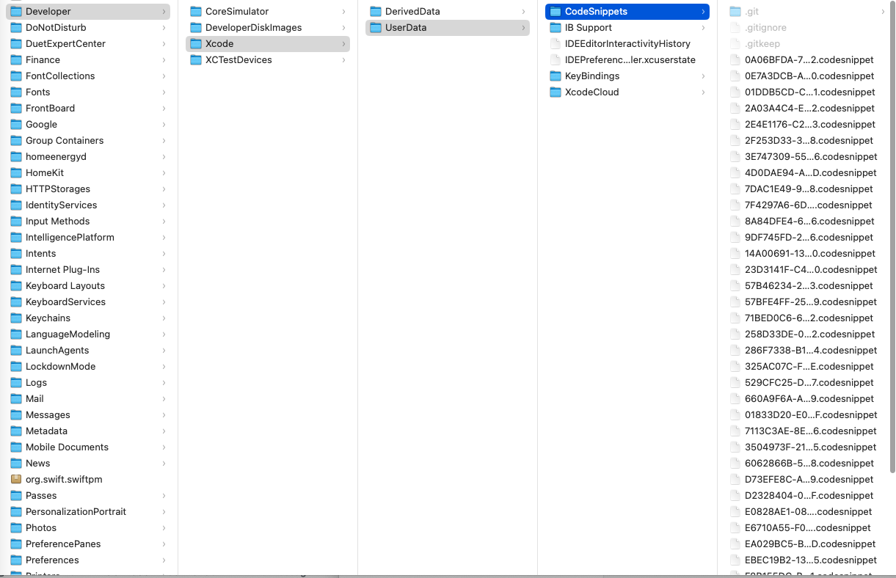

# Jobs（iOS）@Codesnippets

## 一、背景介绍

* 实操发现，由于 Xcode 自身的功能不足，导致我们经常在重写一些系统父类方法时容易忘了调用 `super`，从而出现一些很难排查的诡异bug；

* Xcode 虽然有模糊匹配的代码提醒，但代码提醒只能帮你写方法名，而code snippets 还可以帮你填充一些默认的方法实现，或者直接移动光标到方法体内，省去几次光标操作；

* 一些常用的写法本身语法可能比较复杂，难以记忆，例如实现一个类的单例、使用 `swizzle` 来重写系统控件的方法、block 在不同地方的语法不同等；

* 一些代码本身看似简单，但由于特别常用，所以使用 code snippets 可以大大节省时间；
* <font color=red>**特别鸣谢**</font>：[**QMUI_iOS_CodeSnippets**](https://github.com/QMUI/QMUI_iOS_CodeSnippets.git)

## 二、使用方式
### 1、脚本自动化

> 复制👇🏻下面代码到空白文件，并重命名后缀名为`.command`

```shell
#!/bin/zsh
#set -x  # 启用调试模式
# 打印 "Jobs" logo
jobs_logo() {
    local logo="
JJJJJJJJ     oooooo    bb          SSSSSSSSSS
      JJ    oo    oo   bb          SS      SS
      JJ    oo    oo   bb          SS
      JJ    oo    oo   bbbbbbbbb   SSSSSSSSSS
J     JJ    oo    oo   bb      bb          SS
JJ    JJ    oo    oo   bb      bb  SS      SS
 JJJJJJ      oooooo     bbbbbbbb   SSSSSSSSSS
"
    _JobsPrint_Green "$logo"
}
# 全局变量声明
CURRENT_DIR=$(cd "$(dirname "$0")"; pwd)
CURRENT_DIR_NAME=$(basename "$CURRENT_DIR")
TARGET_DIR="CodeSnippets"
XCODE_USER_DATA_PATH=~/Library/Developer/Xcode/UserData
CODE_SNIPPETS_PATH="$XCODE_USER_DATA_PATH/$TARGET_DIR"
SOURCE_DIR="$CODE_SNIPPETS_PATH/JobsCodeSnippets"
REPO_URL1="git@github.com:JobsKit/JobsCodeSnippets.git"
REPO_URL2="https://github.com/JobsKit/JobsCodeSnippets.git"
# 通用打印方法
_JobsPrint() {
    local COLOR="$1"
    local text="$2"
    local RESET="\033[0m"
    echo "${COLOR}${text}${RESET}"
}
# 定义红色加粗输出方法
_JobsPrint_Red() {
    _JobsPrint "\033[1;31m" "$1"
}
# 定义绿色加粗输出方法
_JobsPrint_Green() {
    _JobsPrint "\033[1;32m" "$1"
}
# 自述信息
self_intro() {
    _JobsPrint_Red "【MacOS】安装JobsCodeSnippets"
    _JobsPrint_Green "需要将文件同步到 ~/Library/Developer/Xcode/UserData/CodeSnippets"
    
    _JobsPrint_Red "按回车键继续..."
    read
}
# 打印当前脚本所在文件夹及其名称，并检查是否为指定文件夹
print_current_dir_info() {
    _JobsPrint_Green "当前脚本所在文件夹：$CURRENT_DIR"
    _JobsPrint_Green "当前脚本所在文件夹名称：$CURRENT_DIR_NAME"
}
# 设置 Git 配置
setup_git() {
    git config --global http.postBuffer 524288000  # 设置缓冲区为500MB
    git config --global http.maxRequestBuffer 1048576000  # 设置缓冲区为1GB
}
# 创建或检查路径
check_and_create_path() {
    _JobsPrint "正在创建路径：$1"
    if [[ ! -d "$1" ]]; then
        _JobsPrint_Red "路径 $1 不存在，正在创建..."
        if mkdir "$1"; then
            _JobsPrint_Green "已创建 $1 文件夹。"
        else
            _JobsPrint_Red "无法创建路径 $1。"
        fi
    else
        _JobsPrint_Green "路径 $1 已存在。"
    fi
}
# 克隆仓库
clone_repo() {
    local repo_url1="$1"
    local repo_url2="$2"
    if git clone "$repo_url1"; then
        _JobsPrint_Green "成功克隆仓库 $repo_url1"
    elif git clone "$repo_url2"; then
        _JobsPrint_Green "成功克隆仓库 $repo_url2"
    else
        _JobsPrint_Red "克隆仓库失败，终止操作。"
        exit 1
    fi
}
# 切换到指定目录并克隆仓库
change_dir_and_clone_repo() {
    local target_dir="$1"
    local repo_url1="$2"
    local repo_url2="$3"
    cd "$target_dir" || { _JobsPrint_Red "无法切换到目录：$target_dir"; exit 1; }
    clone_repo "$repo_url1" "$repo_url2"
}
# 重启 Xcode
reboot_xcode() {
    _JobsPrint_Green "重启 Xcode..."
    killall Xcode
    open -a Xcode
}
# 打开下载的资源文件夹
open_downloaded_folder() {
    _JobsPrint_Green "打开下载的资源文件夹：$CODE_SNIPPETS_PATH"
    open "$CODE_SNIPPETS_PATH"
}
# 移动内容并删除文件夹
move_and_remove_folder() {
    _JobsPrint "移动 JobsCodeSnippets 文件夹下的内容到 CodeSnippets 文件夹..."
    mv "$SOURCE_DIR"/* "$CODE_SNIPPETS_PATH"
    mv "$SOURCE_DIR"/.[!.]* "$CODE_SNIPPETS_PATH"  # 移动隐藏文件
    _JobsPrint_Green "移动完成。"

    _JobsPrint "删除 JobsCodeSnippets 文件夹..."
    rm -rf "$SOURCE_DIR"
    _JobsPrint_Green "删除成功。"
}
# 主函数
main() {
    # 打印 "Jobs" logo
    jobs_logo
    # 自述信息
    self_intro
    # 设置 Git 配置
    setup_git
    # 获取并打印当前脚本所在文件夹及其名称
    print_current_dir_info
    # 创建或检查路径
    check_and_create_path "$CODE_SNIPPETS_PATH"
    # 切换到指定目录并克隆仓库
    change_dir_and_clone_repo "$CODE_SNIPPETS_PATH" \
        "$REPO_URL1" \
        "$REPO_URL2"
    # 重启 Xcode
    reboot_xcode
    # 打开下载的资源文件夹
    open_downloaded_folder
    # 移动内容并删除文件夹
    move_and_remove_folder
    _JobsPrint_Green "脚本执行完成。"
}

main
```

### 2、手动配置

* xcode 的 **Code Snippets** 文件存放于 `~/Library/Developer/Xcode/UserData/CodeSnippets` 目录。

  * 但是`CodeSnippets`目录默认是没有创建的；

  * 终端打开上一级文件。只要下载且安装部署了xcode，那么路径一定存在

    ```shell
    open ~/Library/Developer/Xcode/UserData
    ```

* <font color=red>**注意：不是在 CodeSnippets 里创建一个 JobsCodeSnippets 的目录，这里不支持子目录**</font>；

* 为了方便更新，建议直接将 **JobsCodeSnippets**的内容 `git clone` 到这个目录内，并将这个目录的内容全部提到`CodeSnippets`的根目录下（包括git的隐藏文件），再与[**sourcetree**](https://www.sourcetreeapp.com/)等Git 管理工具进行关联；

  * ```shell
    git clone git@github.com:JobsKit/JobsCodeSnippets.git ./
    或者
    git clone https://github.com/JobsKit/JobsCodeSnippets.git./
    ```

  * 

* 重启 xcode 即可生效

